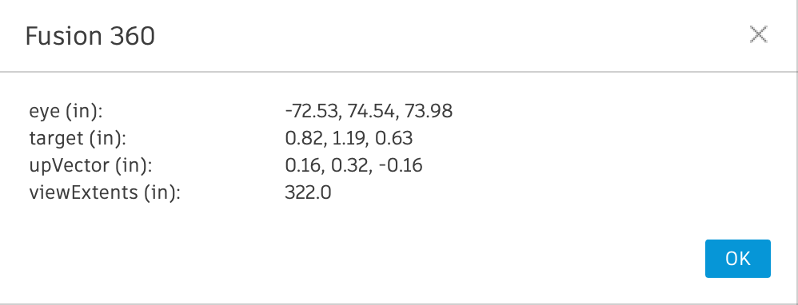

# Fusion360 Scripts

This repo contains a number of Fusion360 scripts.  More info about each script is given in the README.md inside each folder.

I'm very curious about how these scripts are being used, feel free to share your animations in the [Show and Tell](https://github.com/amandaghassaei/Fusion360-Scripts/discussions/9) discussion thread.  Also, pull requests welcome!

## [Design Version Timelapse](Design-Version-Timelapse/)

Turn your Fusion360 design versions (i.e. all your previous saves) into a timelapse animation.


## [Design History Animation](Design-History-Animation/)

Turn your Fusion360 design history timeline into an animation.


## [Spin Animation](Spin-Animation/)

Spin your design and export screenshots.


## [Print Camera State](Print-Camera-State/)

Print the current state of the camera.




## Installation

Download this repository as ZIP and unzip the folder (put this folder in a place where you won't delete it later):


In the *Design* workspace, go to the *Tools* tab and select *Add Ins > Scripts and Add-Ins...*:


Click the green plus sign next to My Scripts:


Then Select the folder called e.g. `Design-History-Animation` inside `Fusion360-Scripts/Design-History-Animation`:


You should now see it added to your scripts.  To Run the script, select it and press *Run*:


## Creating an Animation Video

After all the still frames (with the name FILENAME_###.png) are generated, I use [ffmpeg](https://ffmpeg.org/) to compile the stills into an animation.  From the terminal run:

```ffmpeg -r 30 -i PATH_TO_FRAMES/FILENAME_%d.png -c:v libx264 -preset slow -crf 22 -pix_fmt yuv420p -an OUTPUT_DIRECTORY/animation.mp4```

`-r 30` sets the framerate to 30 fps  
`-c:v libx264 -preset slow -crf 22` encodes as h.264 with better compression settings  
`-pix_fmt yuv420p` makes it compatible with the web browser  
`-an` creates a video with no audio  
You can optionally specify `-s 640x640` to control the output size of the video  
If your filename has spaces in it, you can escape them with `-i PATH_TO_FRAMES/filename\ with\ spaces_%d.png`  


## Creating an Animated GIF

I upload the resulting video or raw frames to [ezgif](https://ezgif.com/) to create an animated gif.  I'm sure many other solutions exist (e.g. Photoshop, Premiere, GIMP, ffmpeg).
