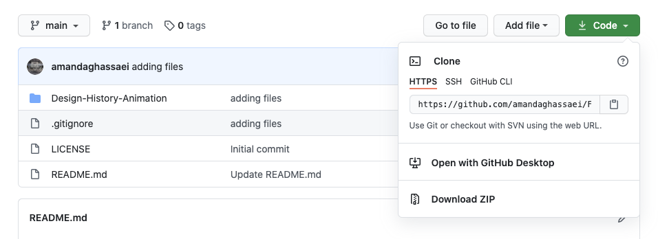
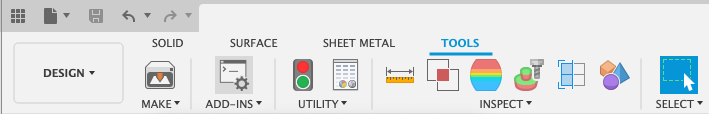
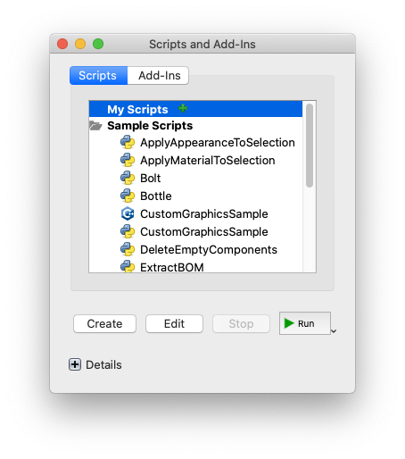
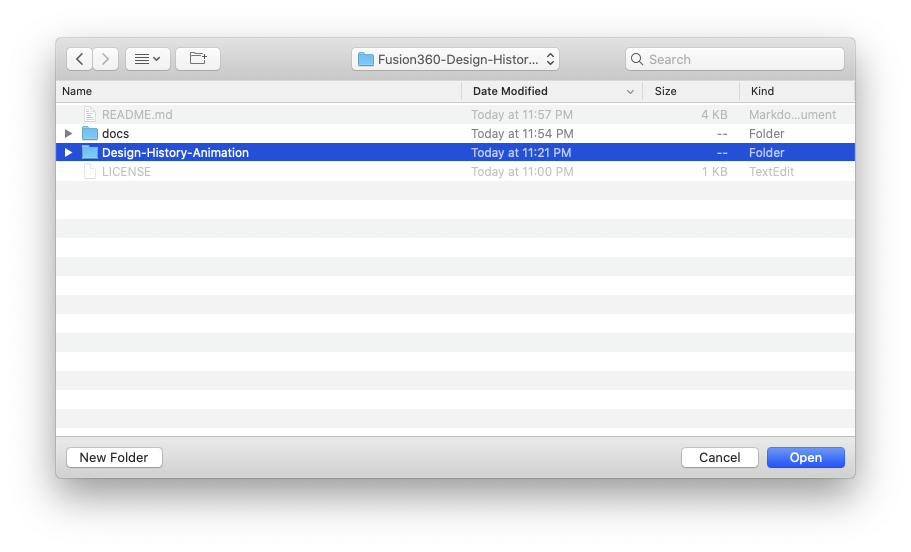

# Fusion360 Scripts

This repo contains a number of Fusion360 scripts.  More info about each script is given in the README.md inside each folder.

## [Design Version Timelapse](Design-Version-Timelapse/)

Turn your Fusion360 version history (i.e. all your previous saves) into a timelapse animation.

## [Design History Animation](Design-History-Animation/)

Turn your Fusion360 design history timeline into an animation.

## [Spin Animation](Spin-Animation/)

Spin you design and export screenshots.

## Installation

Download this repository as ZIP and unzip the folder (put this folder in a place where you won't delete it later):

In the *Design* workspace, go to the *Tools* tab and select *Add Ins > Scripts and Add-Ins...*:

Click the green plus sign next to My Scripts:

Then Select the folder called e.g. `Design-History-Animation` inside `Fusion360-Scripts/Design-History-Animation`:

You should now see it added to your scripts.  To Run the script, select it and press *Run*:

