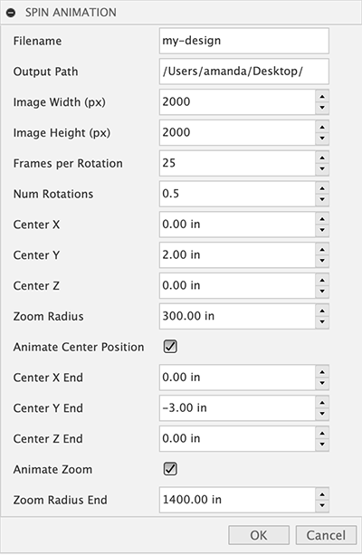

# Spin-Animation
A script to spin your design and generate stills for an animation.

This script can be configured to save at any image resolution!  You can specify other parameters via a small panel:

## Installation

See instructions in the [parent README](https://github.com/amandaghassaei/Fusion360-Scripts#installation).

## Use

A few notes on use:

- Rotation is about the y-axis (this is "up" by Fusion's convention) and the zoom level is set by the current zoom of the camera.
- The script uses the current orientation of the camera for the starting frame.
- *Center X/Y/Z* sets the position of the center point for the spin animation, the camera will center itself around this pivot point, so it will appear in the center of the frame.  When you make changes to these values you will see the camera update interactively.
- *Zoom Rad Start/End* sets the starting and ending zoom of the spin animation.  When you make changes to these values you will see the camera update interactively.

I'm hoping the rest of the parameters in the panel are self-explanatory.

## Creating an Animation Video/GIF

See instructions in the [parent README](https://github.com/amandaghassaei/Fusion360-Scripts#creating-an-animation-video).

## Development

Pull requests welcome!  Some examples of features I'd like to add:

- **Select axis of rotation from edge**: Currently this is set to rotate around the Y axis, but it would be nice to generalize this.